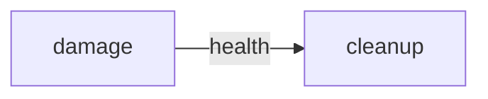

# Pipeline: gameTick

## Execution order
1. physics
2. damage
3. cleanup

## Data flow

## Systems
### physics
- **Reads:** `position`, `velocity`
- **Writes:** `position`

### damage
- **Reads:** `damage`, `health`
- **Writes:** `health`

### cleanup
- **Reads:** `health`
- **Writes:** *(none)*

## Components touched
| Component | Read by | Written by |
|-----------|---------|------------|
| damage | damage | — |
| health | damage, cleanup | damage |
| position | physics | physics |
| velocity | physics | — |
